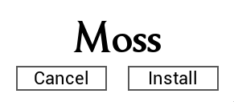
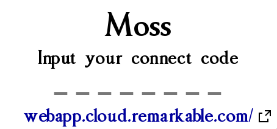
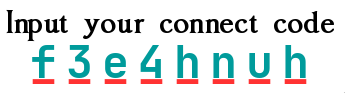

# Quickstart

## Installation

There are 3 main ways of running Moss.

The first is to run it directly from the source code, check [development-and-contribution.md](development-and-contribution.md "mention").

The other is to grab the executable from the [releases page](https://github.com/JustRedTTG/moss-desktop/releases/) and run it on your respective system.

### The installer

The second way is to use Moss in portable mode, just run Moss and click cancel on the installer screen. You can do this to try Moss.

\
Finally if you want to install Moss, simply click install on the installer screen.

> If you are using a custom cloud like **rmfakecloud** it is recommended to edit the `config.json` file (located in the same directory as moss.bin after initially running it) Before installation, change both fields `uri` and `discovery_uri` to your custom cloud's url, for example \
> `https://rmfakecloud.example.com/`  During the installation this config file will be copied and you'll be able to use Moss with your custom cloud.

> On linux you will need to run Moss with sudo to install it. Then you can use the `moss` command to run it with or without sudo

<figure><picture><source srcset=".gitbook/assets/screens-installer-dark.png" media="(prefers-color-scheme: dark)"></picture><figcaption>
The Moss installer screen
</figcaption></figure>

## Initial Sync

It's time to sync to your cloud for the first time. After installing or setting up Moss and running it, you will see a screen like this:

<figure><picture><source srcset=".gitbook/assets/screens-connect-dark.png" media="(prefers-color-scheme: dark)"></picture><figcaption>
The Moss connect code screen
</figcaption></figure>

> Keep in mind that the first time you connect Moss will sync all the information about your documents to your system. **It will not download document data**. This first sync may take some time depending on the amount of documents you have. Do not worry if it takes a while. If it freezes then you can report it as an issue.

After getting your **connect code** from remarkable, which you can do by clicking on the hyperlink below the prompt, you can type or paste into Moss, it will start attempting a connection instantly. \
This is indicated by a dimming of the screen.&#x20;

\
If Moss is successful it will start loading, if the connection wasn't possible for some reason or another, you will see the code underlined with red, erase it and type a new code

<figure><picture><source srcset=".gitbook/assets/errors-code-dark.png" media="(prefers-color-scheme: dark)"></picture><figcaption>
The indicator that there was an issue connecting
</figcaption></figure>

