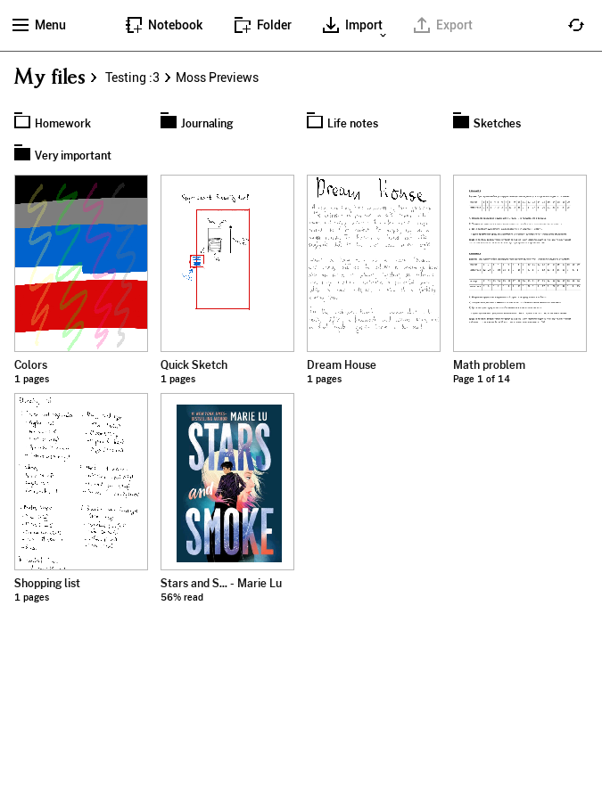
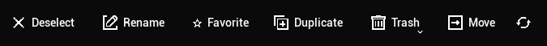
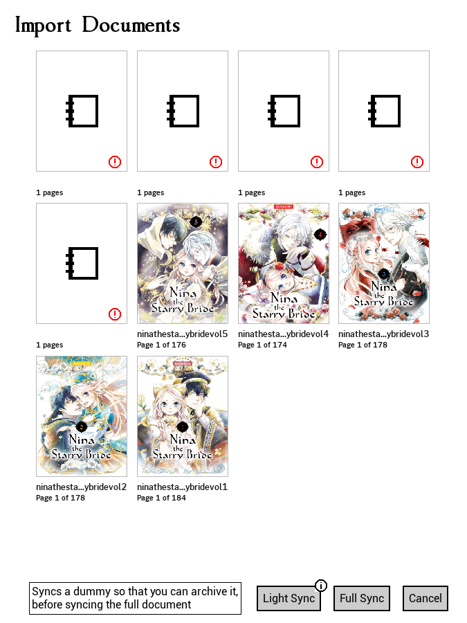

# Moss user interface

<figure><figcaption>
The main menu interface of Moss
</figcaption></figure>

You will find several sections and interactions on this interface that may be a little different from what you are used to, but this is how Moss works, let's take a look at them.

## The main menu

This is the most advanced screen in Moss and is the also the screen you will be interacting the majority of the time. It has several components to it.

### The document view

The majority of the UI is designated as your document view, where you can see folders and documents.

1. You can click on any folder / document to open it.
2. You can use Ctrl + Scroll to scale the UI and fit more things.
3. You can use Scroll to go up and down as expected.
4. You can select/deselect any item by right clicking it.
5. If you have debug enabled you will find a debug button on the top right of every document which will open a context menu with debug options.

### The top bar

The top bar has several states, these will described below separately.

#### The default state

This is usual state of the bar, indicated by it's color fitting the rest of the UI\

<figure><figcaption>
The Moss top bar in it's default state
</figcaption></figure>

1. **Notebook** - Asks for a name and adds a blank 1 page notebook to the current folder you are in.
2. **Folder** - Asks for a name and adds an empty folder to the current one you are in.
3. **Import** - Lets you import a PDF or EPUB format by default. If you want to check for more import options, right click the button and a context menu will show more options.
   * Notebook import - This function helps you import `.rm` files straight as notebooks.

#### The selection state

When you select a few documents and folders Moss will transition to a selection bar, showing some key functions for your selection.

<figure><figcaption>
The Moss top bar when items are selected
</figcaption></figure>

1. **Deselect** - Quickly cancels your selection.
2. **Rename** - This option is only shown when you have one selection, it allows you to rename the item.
3. **Favorite** - Depending on your selection this will either add all the items to favorites or remove them, this is indicated by the star icon, if it is filled it means that the items will be added to favorites, if the star is empty like in the image above it means the items will be removed from favorites.
4. **Duplicate** - This will make a copy of documents and **folders** and add a prefix to them.
5. **Trash** - This is another button that has extra options, in-case you want to delete something instantly without moving it to trash, you can right click to open a context menu with the option to delete all the selected items instantly. Otherwise this button will move all the items to trash.

> Please note that if you have your tablet opened on the same folder and delete an item, the tablet may not properly display this interaction, you can change folders back and forth and the tablet will display the changes properly

6. **Move** - This function will change the bar again into the move state described below.

#### The move state

When you want to move something in Moss the bar will change to show a few more options

<figure><figcaption>
The Moss top bar when you choose to move your items
</figcaption></figure>

1. **Cancel move** - This will simply tell Moss to revert the bar to the selection state without cancelling your selection.
2. **Deselect** - This will both cancel the move and your selection.
3. **Folder** - This gives you the option to quickly make a new folder in the one you are currently in, this is the same as in the default bar state
4. **Move here** - This will complete the move and transfer all documents and folders to the folder that you are currently in
5. **Duplicate here** - This is a nifty feature only in Moss which allows you to duplicate your documents, but choose the folder you want it to duplicate to. This is very handy if you decide you want to keep the items in two separate places without the need to duplicate and then move the duplicated items to another folder.\

### The side bar

This long strip of buttons should be familiar to you if you ever explored your remarkable tablet, it can be opened by the top bar and will expand to show the current menu you are in. It also allows you to navigate to other screens. The current menu selection is indicated in the secondary color.

> This section is not finished since the sub menus are still in progress, but I am sure you can figure out the side bar by going though it

## The document viewer

When you click on a document Moss will instantly go to work downloading it (this is indicated by a cloud icon with a down arrow on the bottom right). \
Be careful since Moss will instantly open the document once it is downloaded, so if you open multiple documents Moss will initiate several document viewers for each of the documents you opened.\
This is not an issue but it means that you'll have to close each document viewer until you've reached back to the main menu, if your goal is to download these documents, there are settings for that.

The document viewer in Moss is currently very basic, here's some things to note:

1. To close the document viewer, drag from the top (like on the tablet) if you find that unintuitive, leave a thumbs up on [this issue](https://github.com/JustRedTTG/moss-desktop/issues/10).
2. You can use the arrow keys to navigate between pages.

## The import screen

This screen will be shown any time you import documents into Moss, it is an intermediate screen which takes a few steps.

1. It loads all the information and prepares documents for upload
2. It allows the user to cancel the operation or do a **light sync**

<figure><figcaption>
Waiting for Moss to process all the documents to import
</figcaption></figure> <figure><figcaption>
Waiting for light sync to finish, progress bars can be seen
</figcaption></figure> <figure><figcaption>
Archiving the documents on the remarkable tablet
</figcaption></figure>

You will find that the import screen is very basic with only three buttons.

### Light sync

The light sync feature in Moss is a very handy feature that helps people with low device storage keep uploading documents to their cloud without their tablet instantly attempting to fill it's low amount of storage by downloading these documents.\

Here's how to properly light sync using Moss

1. Click on light sync. Upon doing so you will see the import screen slowly start to import the documents. An indicator for this is the fact that loading bars will be shown and the buttons will be disabled until the sync is done.
2. On your tablet, go to the folder where you did the import. **Archive all the imported documents**, these documents contain a one page preview, which should remain visible after completing the full sync.
3. After you have made sure that the tablet has archived and synced all these **light synced** documents, go back to Moss and complete the operation by doing a full sync and uploading the full documents to the cloud.

